# 投研系统 · Stock Research System

<p align="center">
  
  
  
  
  
  
</p>

> 面向 A 股的全栈投研平台：多专家协同研判、专业 K 线行情分析、量化回测与防过拟合评估、可插拔交易成本模型与风险归因、模拟盘研究闭环、自选股异动监控，以及对话式研究助手。

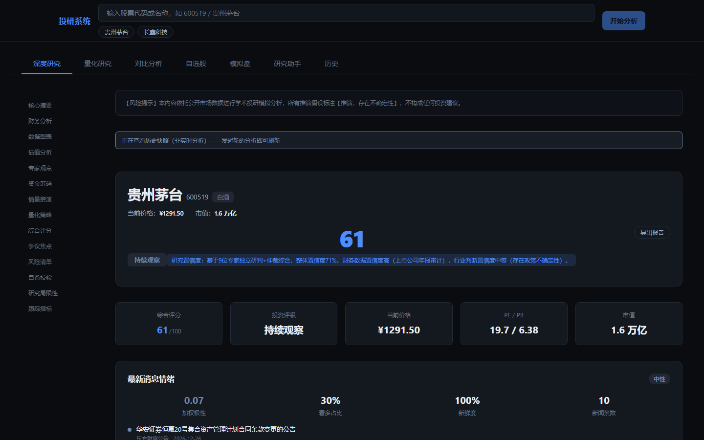

## 系统架构

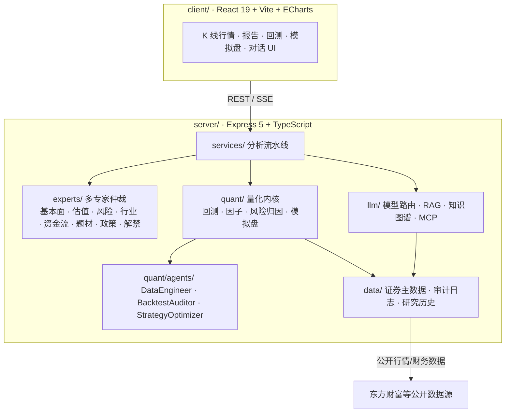

## 目录

- [核心特性](#核心特性)
- [界面展示](#界面展示)
- [量化内核](#量化内核)
- [技术架构](#技术架构)
- [快速开始](#快速开始)
- [API 概览](#api-概览)
- [测试与质量](#测试与质量)

## 核心特性

**深度研究（多专家协同研判）**
输入 6 位 A 股代码，基本面、估值、风险、行业、资金流、题材、政策、解禁等多路专家独立研判，再经仲裁综合为一份结构化研究报告：核心摘要、财务分析、估值分析、专家观点、资金筹码、情景推演、综合评分、争议焦点、风险清单与跟踪指标，全程流式推送进度。同一股票再次分析时，报告头部会显示**「较上次分析」**的评级与评分变化（记忆反思闭环），让观点演化一目了然。

**健壮性与自我校准**：单个专家研判失败会自动降级剔除，不再拖垮整次分析，报告如实标注实际参与研判的专家数；分析中断后可携带 `resume` 从最后一个成功阶段续跑，跳过已完成的取数/专家/仲裁环节，不再重复支付已完成的 LLM 成本；历次评级会与其后的实际收益对账，统计评级命中率并注入仲裁提示（决策-结果闭环），让系统知道自己的判断历史上是否兑现。

**专业 K 线行情分析**
蜡烛图（红涨绿跌）、MA5/10/20/60 均线、BOLL 布林通道、MACD、成交量、日/周/月周期切换、区间缩放、右侧价格轴与最新价标线、吸顶 OHLC 图例。

**量化回测与防过拟合评估**
可配置策略（均线交叉 / 动量 / 均值回归）回测引擎：**双层防前视**（K 线数据截止校验剔除区间外行 + **T+1 信号延迟成交**：信号日收盘生成、次一交易日开盘价成交）、**可插拔交易成本模型**（A 股真实费率：佣金万 2.5 双边 + 印花税万 5 仅卖出单边 + 最低佣金 5 元 + 二次方市场冲击）、**可插拔绩效分析器**（总收益 / 年化 / Sharpe / Sortino / 最大回撤 / 胜率 / 盈亏比，可自定义扩展）；并以 Deflated Sharpe Ratio（DSR）、CSCV 回测过拟合概率（PBO）、Walk-Forward 样本外检验扣除"多试取优"的搜索偏差。

**风险归因（风格因子暴露）**
对标 GS Quant RiskModel 的轻量版：规模 / 价值 / 动量 / 盈利 / 杠杆五风格因子暴露（z 分数）+ 系统风险 / 特异风险分解 + 因子解释占比，报告风险区可视化呈现。

**模拟盘研究闭环**
无实盘资金的验证闭环：策略信号 → 模拟下单 → 日终按收盘价撮合（遵循 A 股 T+1、涨跌停拒单、整手 100 股、佣金印花税）→ 记录每日净值 → 绩效统计（累计收益 / 最大回撤 / 年化夏普），全程合规审计留痕。

**自选股与异动监控**
自选股清单管理、批量含最新消息回测、异动预警监控（强烈看多 / 看空 / 高影响）。

**对话式研究助手**
自然语言提问，检索增强（RAG）取证、多空辩论、事实校验与幻觉防护、知识图谱上下文，SSE 流式返回，支持研究增强模式。

**港美股财务估值**
港美股基本面与估值数据（东方财富 datacenter 网关，免费无 token）。

## 界面展示

|               深度研究报告（总览）                |        K 线走势（蜡烛/均线/BOLL/MACD）        |
| :-----------------------------------------------: | :-------------------------------------------: |
|  | 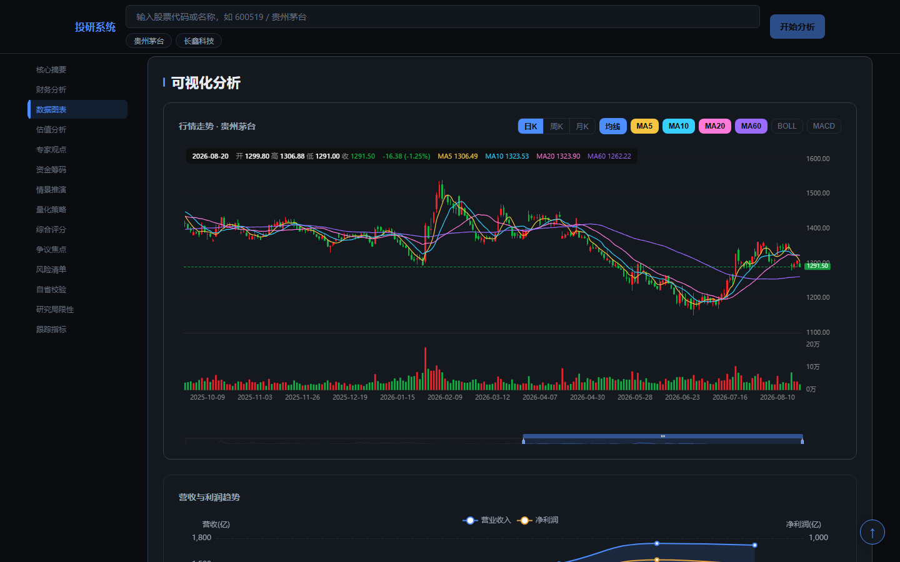 |

|                五维评分与多空争议                |         财务图表（营收/利润/盈利能力）          |
| :----------------------------------------------: | :---------------------------------------------: |
| 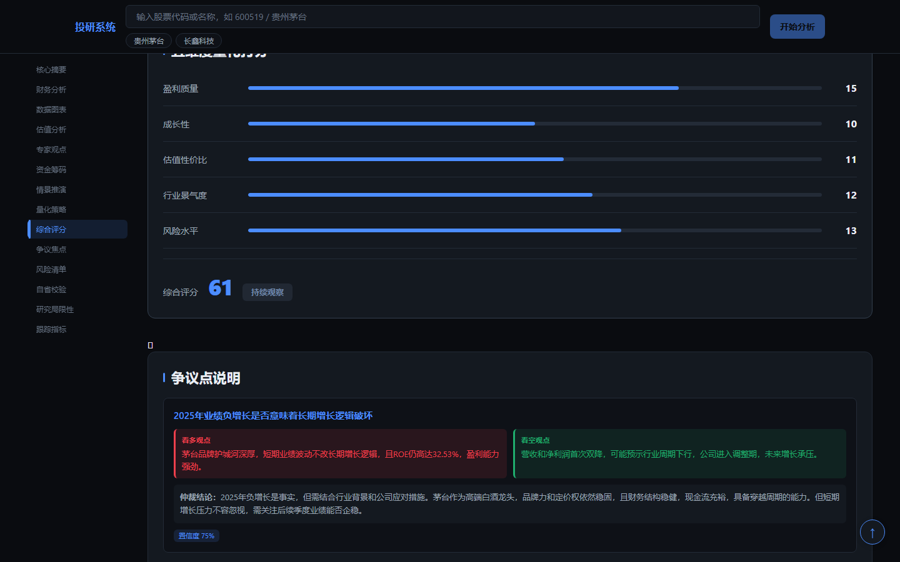 | 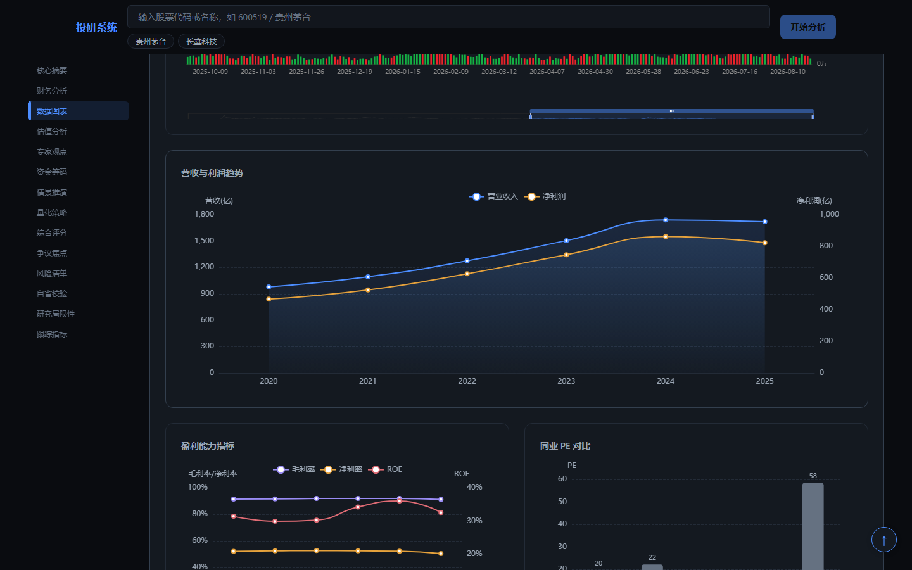 |

|          量化回测（策略配置与结果研判）          |           对比分析（多股票横向对比）           |
| :----------------------------------------------: | :--------------------------------------------: |
| 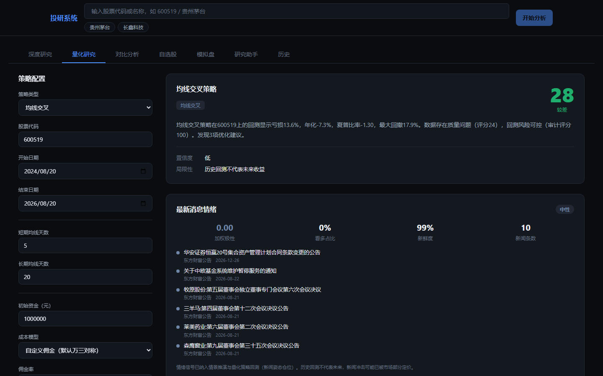 | 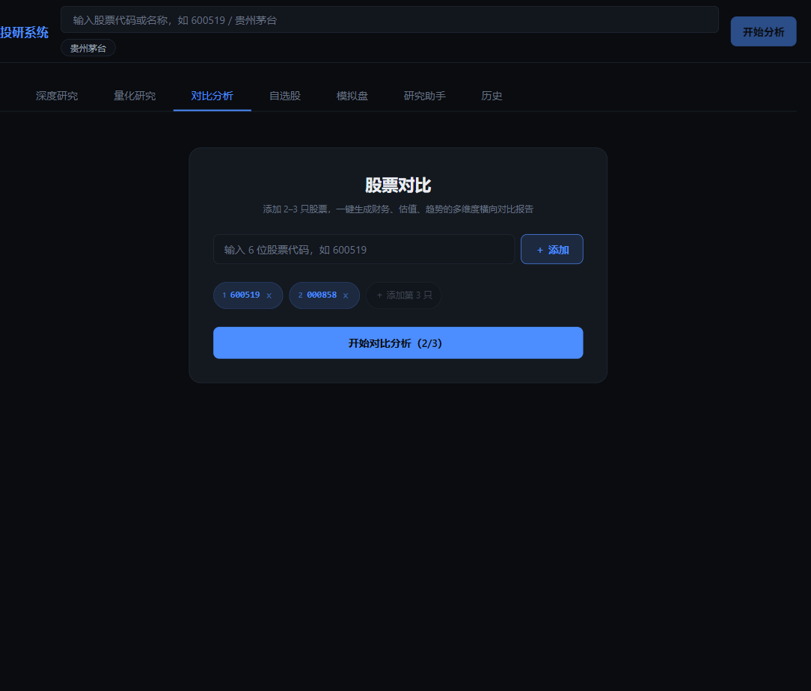 |

|                自选股与异动监控                |           模拟盘（A 股规则撮合）           |
| :--------------------------------------------: | :----------------------------------------: |
| 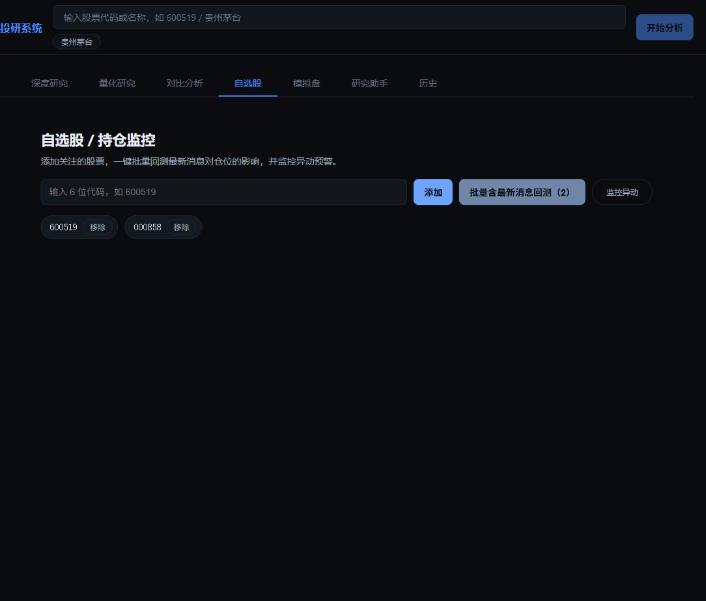 | 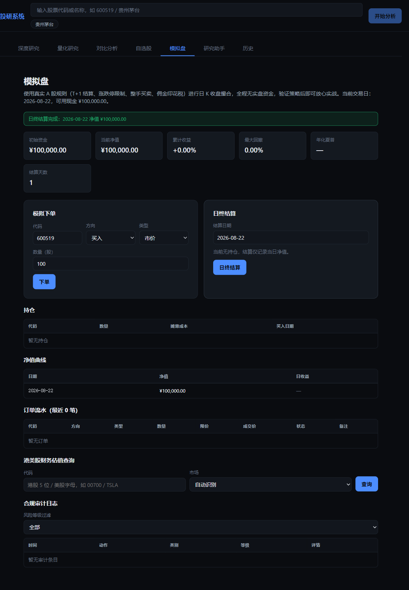 |

|               对话式研究助手                |              研究历史（记忆闭环）              |
| :-----------------------------------------: | :--------------------------------------------: |
| 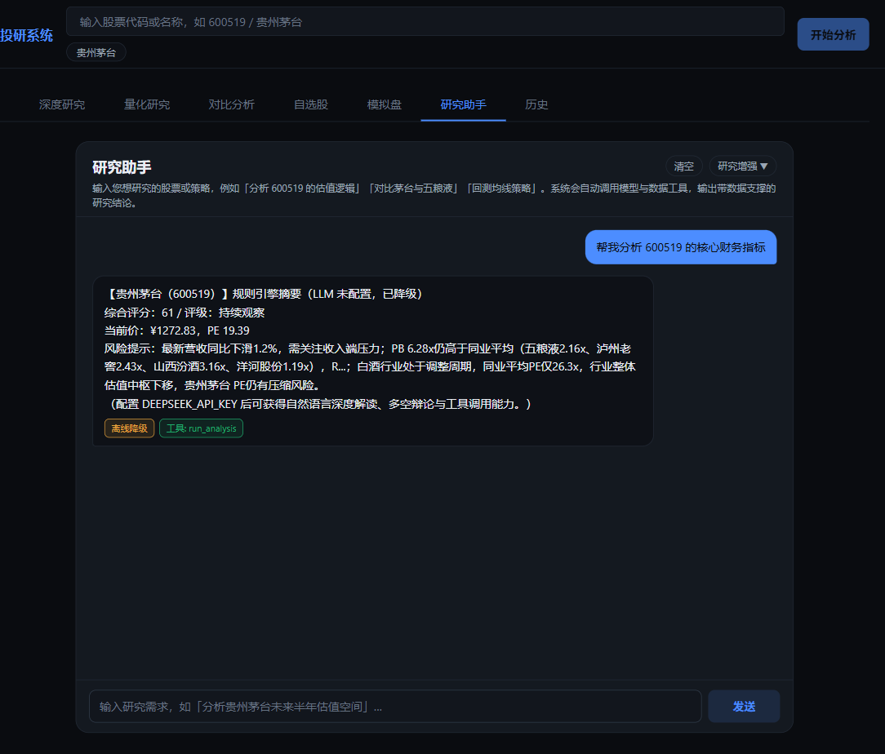 | 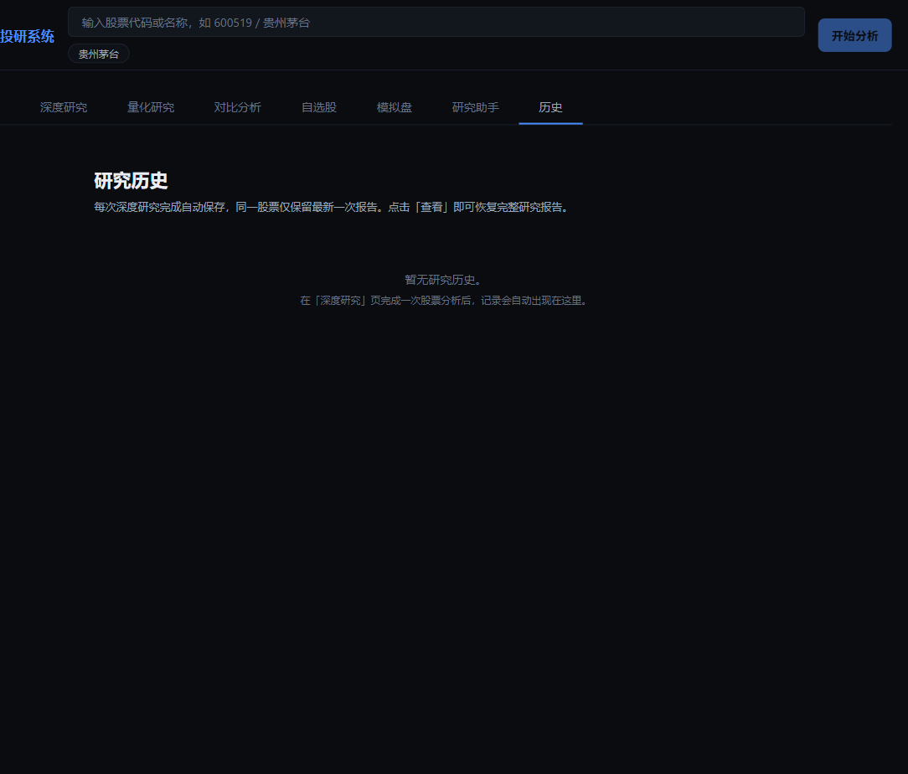 |

## 量化内核

量化层对标 backtrader / qlib / GS Quant 三个高 star 开源引擎的架构提炼，落地以下设计：

| 设计                | 借鉴来源                            | 说明                                                                                      |
| ------------------- | ----------------------------------- | ----------------------------------------------------------------------------------------- |
| Analyzer 绩效分析器 | backtrader                          | 统计 = 可插拔纯函数分析器集合，新增指标零引擎改动                                         |
| RiskModel 风险归因  | gs-quant                            | 风格因子暴露 + 系统/特异风险分解（经验波动率常量版）                                      |
| 可插拔成本模型      | backtrader / qlib / gs-quant        | `CostModel {openRate, closeRate, minCost, slippage, impactCost}`，A 股真实费率一键启用    |
| T+1 信号延迟成交    | backtrader Market 单 / qlib shift=1 | 信号 T 日生成、T+1 开盘成交，杜绝收盘价即时成交的不可实现口径                             |
| K 线数据截止校验    | TradingAgents                       | look-ahead 过滤：剔除回测区间外的未来/越界行，与 T+1 构成双层防前视防线                   |
| 每日截面 IC 序列    | qlib calc_ic / ICIR                 | 因子按日截面 Spearman IC + ICIR（mean/std）加权，避免跨期秩混合扭曲                       |
| 记忆反思闭环        | TradingAgents                       | 分析头部展示与上次分析的评级/评分变化（vs_previous），导出报告同样携带                    |
| 单专家降级          | TradingAgents                       | 节点级 crash-safety：专家并行 + 有限重试 + allSettled，失败者剔除并披露，不再拖垮整次分析 |
| 断点续跑            | TradingAgents                       | 按阶段落盘 checkpoint，中断后从最后成功阶段恢复，成功后自动清除，含 TTL 过期保护          |
| 决策-结果闭环       | TradingAgents                       | 评级台账回填实际收益与相对沪深300超额，统计命中率并注入仲裁（从"观点漂移"到"观点兑现"）   |

## 技术架构

```
client/          React + Vite + ECharts 前端
server/          Express API 服务
  ├── services/     分析流水线 + 多专家仲裁 + 历史记忆闭环
  │   ├── experts/    基本面 / 估值 / 风险 / 行业 / 资金流 / 题材 / 政策 / 解禁 / 仲裁
  │   ├── expertRunner.ts        多专家并行 + 有限重试 + 单专家降级
  │   ├── analysisCheckpoint.ts  按阶段落盘的断点续跑（TTL 过期保护）
  │   └── outcomeTracker.ts      评级台账：实际收益回填 + 命中率统计
  ├── quant/        回测引擎（Analyzer + CostModel + T+1）+ 因子分析 + 风险归因 + 模拟盘
  │   └── agents/     DataEngineer / BacktestAuditor / StrategyOptimizer
  ├── llm/          模型路由、成本治理、RAG、知识图谱、MCP 工具
  └── data/         证券主数据 / 模拟盘账户 / 审计日志 / 研究历史（本地缓存）
```

**技术栈**

- Monorepo（npm workspaces）：`server/`（Express 5 + TypeScript）+ `client/`（React 19 + Vite 8 + ECharts 6）
- 测试：Vitest（服务 / 量化 / 前端组件，923 用例）+ Playwright（E2E 9 用例）+ GitHub Actions CI（质量门禁 + 覆盖率阈值 + E2E）

## 快速开始

```bash
npm install --legacy-peer-deps --dangerously-allow-all-scripts
npm run dev:server    # 后端 → http://localhost:3001
npm run dev:client    # 前端 → http://localhost:5173
```

> 安装说明：`--legacy-peer-deps` 用于绕过 TypeScript 7 与 typescript-eslint 的 peer 依赖冲突；`--dangerously-allow-all-scripts` 用于放行 esbuild 等构建工具的原生安装脚本（本仓库依赖无第三方 postinstall 恶意脚本，仅本机安装依赖时使用该参数）。

生产构建：

```bash
npm run build         # server + client，单端口同源托管
```

Windows 一键启动：双击 `启动系统.bat`（零依赖，自动安装并拉起前后端）。

## API 概览

| 分类      | 接口                                                                                                 | 说明                                                                                        |
| --------- | ---------------------------------------------------------------------------------------------------- | ------------------------------------------------------------------------------------------- |
| 分析      | `POST /api/analyze`                                                                                  | 6 位 A 股代码多专家研判（含风险归因 + 历史对比）；body 传 `resume: true` 可从上次中断处续跑 |
|           | `GET /api/analyze/stream`                                                                            | SSE 流式分析（逐阶段推送进度）；`?resume=1` 续跑                                            |
|           | `POST /api/compare`                                                                                  | 2-3 只股票横向对比                                                                          |
|           | `GET /api/stocks`、`GET /api/stocks/search`                                                          | 股票列表 / 搜索                                                                             |
| 历史      | `GET /api/history`、`GET /api/history/:id`、`DELETE /api/history/:id`                                | 研究历史列表 / 详情 / 删除（同代码去重，容量 100）                                          |
| 量化      | `POST /api/quant/analyze`                                                                            | 量化研究（回测 + 数据质量 + 审计 + 优化 + 摘要）                                            |
|           | `POST /api/backtest/evaluate`                                                                        | 受控评估：新闻叠加 vs 基线（DSR / Bootstrap CI）                                            |
| 模拟盘    | `GET /api/paper/portfolio`                                                                           | 账户：现金 / 持仓 / 订单 / 每日净值                                                         |
|           | `POST /api/paper/order`                                                                              | 模拟下单（市价/限价，A 股规则撮合）                                                         |
|           | `POST /api/paper/settle`                                                                             | 日终结算：按收盘价撮合挂单 + 记录当日净值                                                   |
|           | `GET /api/paper/stats`                                                                               | 累计收益 / 最大回撤 / 年化夏普                                                              |
| 审计      | `GET /api/audit`                                                                                     | 合规审计查询（类别 / 风险等级 / 时间 / 会话过滤）                                           |
| 港美股    | `GET /api/intl/fundamentals?code=&market=`                                                           | 港美股财务估值（`market=HK/US`）                                                            |
| 对话      | `POST /api/chat`、`GET /api/chat/stream`                                                             | 自然语言研究助手（SSE 流式）                                                                |
| 自选股    | `GET/POST/DELETE /api/watchlist`、`POST /api/watchlist/news-backtest`、`POST /api/watchlist/monitor` | 清单管理 / 批量新闻回测 / 异动监控                                                          |
| 自治循环  | `POST /api/autonomous/start`、`/stop`、`GET /api/autonomous/status`                                  | 主动监控自治循环                                                                            |
| 文档 RAG  | `POST /api/ingest`、`GET /api/documents`                                                             | 研报/财报/公告 PDF/文本入库 + 洞察抽取                                                      |
| 模型/成本 | `GET /api/models`、`GET /api/cost`、`POST /api/cost/reset`                                           | 多模型路由 / 成本治理                                                                       |
| 其他      | `GET /api/health`                                                                                    | 健康检查（外部 API 可达性 + 缓存目录）                                                      |
|           | `GET /api/metrics`                                                                                   | Prometheus 指标导出                                                                         |
|           | `GET /api/openapi.json`                                                                              | OpenAPI 3.1 机器可读契约                                                                    |

## 测试与质量

```bash
npm test              # Vitest 全量单测（977 用例：服务 / 量化 / 前端组件）
npm run test:e2e      # Playwright 端到端（9 用例，真实浏览器 + 隔离数据）
npm run lint          # ESLint
npm run format:check  # Prettier 格式检查
```

- **CI 门禁**（GitHub Actions）：lint / 双端 tsc / 双端 build / 全量测试 + 覆盖率阈值（lines ≥ 70%）/ Playwright E2E。
- **受控评估**：`compareBacktests` 输出 DSR（扣除搜索偏差）与 Bootstrap 置信区间；`quant/cscv.ts` 以组合对称交叉验证计算过拟合概率（PBO）；`walkForward.ts` 以 OOS 夏普 < 70% × IS 夏普判定过拟合。
- **合规审计**：金融监管 8 号文留痕 + 运行时熔断 + `/api/audit` 查询。
- **全链路追踪**：`X-Trace-Id` + 模型调用 span / 成本。

---

> 风险提示：本项目为学术投研模拟工具，所有分析依托公开市场数据，推演假设均标注不确定性，不构成任何投资建议。
